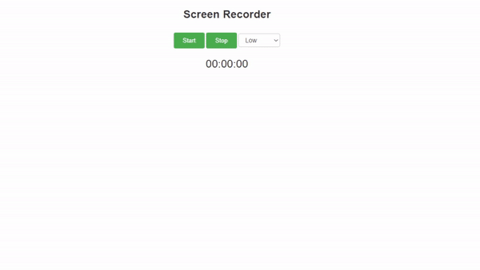

<div align='center'>


  
  
  <a href="https://linksta.cc/@Bebedi"></a>
  


</div>

<div align='center'>
  <h1> 🌅 Screen Recorder Extension</h1>
  <p>Record your screen and audio using this Chrome extension</p>
</div>

<p align="center">
  <a href="#demo">Demo</a> •
  <a href="#features">Features</a> •
  <a href="#installation">Installation</a> •
  <a href="#usage">Usage</a> •
  <a href="#contributing">Contributing</a> •
  <a href="#license">License</a>
</p>

---


## 📋 Demo



## 🔥 Features

- Record your screen and audio
- Real-time timer display
- Adjustable video quality


## 📘 Installation

1. Clone the repository:
   ```bash
   git clone https://github.com/your-username/screen-recorder-extension.git
   
2. Open Google Chrome and navigate to `chrome://extensions`.

3. Enable Developer Mode using the toggle switch in the top right corner.

4. Click on the "Load unpacked" button and select the cloned repository folder.

5. The extension will be installed and ready to use.

## 😍 Usage

1. Click on the extension icon in the toolbar to open the screen recorder.

2. Click the **Start** button to begin recording.

3. Select the desired video quality from the dropdown menu.

4. The timer will start counting the duration of the recording.

5. Click the **Stop** button to stop the recording.

6. The recorded video will be saved in your Downloads folder.

## 🤝 Contributing

If you find a bug or have an idea for a feature, feel free to open an issue or submit a pull request.

## 📄 License

This project is licensed under the MIT License - see the [LICENSE](LICENSE) file for details.